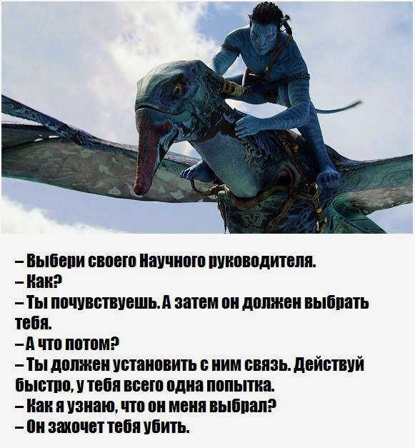

```{r setup, include=FALSE}
knitr::opts_chunk$set(echo = TRUE)
```

На этой страничке собраны основные инструкции для студентов, которые пишут курсовые работы или дипломные работы (ВКР) под моим руководством или рассматривают такую возможность. 

## Условия работы

Условиями продуктивной работы я считаю сочетание трех элементов: 

1. Я руковожу эмпирическими работами, предполающими серьезную работу с данными, а также ответы на содержательные экономические вопросы при помощи методов статистики и эконометрики. Поэтому от вас я тоже ожидаю живой интерес к эмпирической работе, в т. ч. желание осваивать методы, выходящие за рамки базовых курсов статистики и эконометрики (при необходимости).

2. У меня есть собственные научные интересы, в рамках которых я формулирую потенциальные темы для исследований. Наиболее надежным путем для студентов я считаю выбор одной из таких тем, т. к. по ним я смогу вас больше консультировать и направлять. Возможен и такой вариант, при котором вы сами формулируете тему исследования. В этом случае я могу согласиться или не согласиться руководить работой, но даже если соглашусь, основная нагрузка по разработке темы ляжет на ваши плечи. Подробнее см. [по ссылке](topics.html).

3. Я неприемлю стратегии "делать все в последний момент", поэтому я ожидаю от вас, что вы включитесь в работу сразу и будете поддерживать достаточный уровень активности на протяжении всего учебного года. Подробнее см. [по ссылке](timetable.html).


## Инструкции в помощь студентам

[По ссылке](tips.html) вы можете посмотреть некоторые советы по работе над курсовой/ВКР. 

РАЗДЕЛ БУДЕТ ПОПОЛНЯТЬСЯ В ТЕЧЕНИЕ ГОДА.


